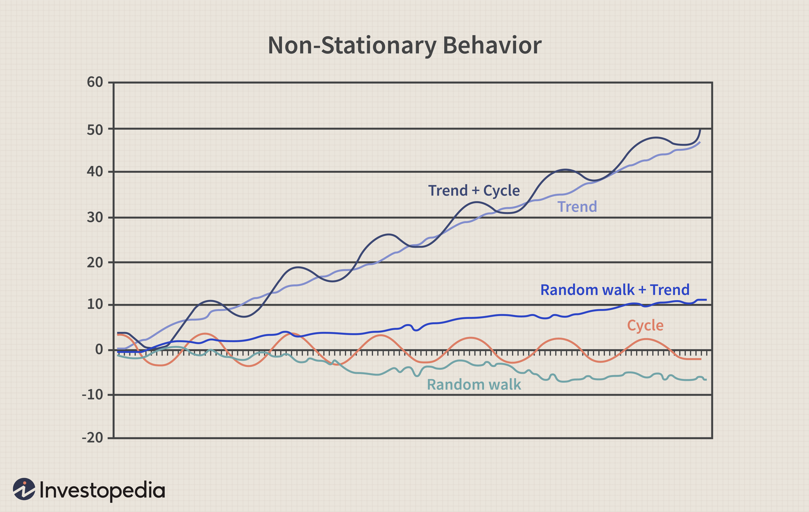

class: title-slide, center, middle
```{r, echo = FALSE}
# https://stackoverflow.com/questions/25646333/code-chunk-font-size-in-rmarkdown-with-knitr-and-latex
def.chunk.hook  <- knitr::knit_hooks$get("chunk")
knitr::knit_hooks$set(chunk = function(x, options) {
  x <- def.chunk.hook(x, options)
  ifelse(options$size != "normalsize", paste0("\\", options$size,"\n\n", x, "\n\n \\normalsize"), x)
})
knitr::knit_hooks$set(crop = knitr::hook_pdfcrop)
```

```{r, echo = FALSE, results="asis"}
cat('# ', rmarkdown::metadata$title)
```

```{r, echo = FALSE, results="asis"}
cat('## ', rmarkdown::metadata$subtitle)
```

```{r, echo = FALSE, results="asis"}
cat('### ', rmarkdown::metadata$author)
```

```{r, echo = FALSE, results="asis"}
cat('#### ', rmarkdown::metadata$institute)
```

```{r, echo = FALSE, results="asis"}
cat(rmarkdown::metadata$date)
```

.footnote[
.right[
.tiny[
You can find the code and data of this presentation at [https://github.com/MartinHinz/pppa_brno_2021](https://github.com/MartinHinz/pppa_brno_2021).
]
]
]

---
class: inverse, bottom, right
# Introduction and Setting the Frame

---
## Definition

> *Point pattern analysis (PPA) is the study of the spatial arrangements of points in (usually 2-dimensional) space. - wikipedia*

### Centrography
- Measuring the parameters of some point distribution

### Density Analysis
- Visualisation ended up rotation of the density of points

### Distance based Analysis
- Statistical analyses of the distance between points and its distribution

### Modeling
- Modelling spatial processes and comparing the results to actual observed data

---

## Difficulties and tasks

### Get the data
You are responsible.

### Get the data into R
You will see how data needs to be structured to be able to read it into R.

### Using the right tools in the right way
I will demonstrate some tools and their application in special statistics.

### Making the right interpretations and conclusions
You are responsible (again).

---
## Install some packages

You need:

```{r}

list.of.packages <- c("sf", # Handling spatial data
                      "raster", # Handling raster data
                      "maptools", # additional spatial functionality
                      "spatstat", # spatial statistic 
                      "ggplot2", # general plotting library
                      "rnaturalearth" # Getting some Geodata
)

new.packages <- list.of.packages[
  !(list.of.packages %in% installed.packages()[,"Package"])
  ]

if(length(new.packages)) install.packages(new.packages)
```

Optional:

```{r eval=FALSE}
# package for centrographic statistics
# We only might need it once
if (!require("aspace")) install.packages("aspace")
```


---
class: inverse, bottom, right
# Data Preparation and Import

---

## Get some data

* [location of 14C dated sites in Czech Republic](data/c14sites.csv)
* [location of 14C dated sites in Czech Republic in a different format](data/c14sites_comma.csv)

Save them to a folder of your choice

### Set your working directory

The easiest at the moment in R at Menu > Session > Set Working Directory > Choose Directory

(there are other ways...)

Point to the same folder where you saved the files

---

## Import formats

### Probably the standard (and worst possible) starting point

- Spreadsheet data 
  - here from our 14C database in development XRONOS
  - sites with 14C data of Czech Republic
  - not very complete... you probably know better sources (for the time being ;-) )


---

### Save as CSV

- CSV: Comma Separated Values
- you can im-/export csv from every spreadsheet software (MS Excel, Libre Office Calc, ...)


---
### CSV vs. 'CSV2'

- two flavours:
  - Anglo-American: comma ',' as column separator, point '.' as decimal separator
  - 'continental': semicolon as column separator, comma ',' as decimal separator
- which one you use depends on your language settings


---

## Reading csv into R

For reading CSV data into R, you can use the 'read.csv()' function.

Pay attention to use the correct function for your language settings.

```{r}
 # if you have an anglo-american csv (comma)
data <- read.csv("data/c14sites_comma.csv")
# if you have a continental csv (semicolon)
data <- read.csv2("data/c14sites.csv") 

data
```

---

## From data to spatial data

- There are multiple packages for handling spatial data
- Which one to use depends on preferences
- We are using sf here

```{r}
library(sf)

# Convert the dataframe to a spatial object. Note that the
# crs= 4326 parameter assigns a WGS84 coordinate system to the 
# spatial object
data.sf <- st_as_sf(data,
                    coords = c("lng", "lat"), # coordinate columns
                    crs = 4326)  # coordinate references system in epsg
data.sf
```

---

## Mapping the data

.pull-left[
### simple

Just use plot

```{r}
plot(data.sf) # inbuild plots
```
]

.pull-right[
### more elaborated

using the gglot and natural earth data

.tiny[
```{r}
library(ggplot2) # for nicer plots
library(rnaturalearth) # for geodata

worldmap <- ne_countries(scale = 'medium',
                         type = 'map_units',
                         returnclass = 'sf')
ggplot() + geom_sf(data = worldmap) + geom_sf(data=data.sf) +
    coord_sf(xlim = c(0,40), ylim = c(45,55)) + theme_bw()
```
]]


---

## Problem: lng-lat vs. projection

- Most of the tools for point pattern analyses required distances
- Unprojected coordinate reference systems like the longitude latitude system are not distance correct
- We have to re-project our data

.pull-left[
```{r}
plot(data.sf, graticule = TRUE)
```
]

.pull-right[
```{r}
data.utm <- st_transform(data.sf,
                         crs = 32633)
plot(data.utm, graticule = TRUE)
```
]

---

## To come from lng/lat spreadsheat to R spatial data:

### in three simple steps

```{r}
data <- read.csv2("data/c14sites.csv")
data.sf <- st_as_sf(data,
                    coords = c("lng", "lat"), # coordinate columns
                    crs = 4326)  # coordinate references system in epsg
data.utm <- st_transform(data.sf, crs = 32633)
```

---
class: inverse, bottom, right
# Centrography

---

## Center, standard distance and standard deviational ellipse
.pull-left[

.caption[source: https://mgimond.github.io]
]

.pull-left[
.tiny[
```{r}
mean_center <- apply(st_coordinates(data.utm),
                     2,
                     mean)

mean_center.df <- as.data.frame(t(mean_center))

mean_center.utm <- st_as_sf(mean_center.df,
                    coords = c("X", "Y"), 
                    crs = 32633)

standard_distance <- mean(
  st_distance(mean_center.utm,
              data.utm))

dx <- sqrt(
  sum(
    (st_coordinates(data.utm)[,1]-
         mean_center[1])^2
    ) / nrow(data.utm)
)

dy <- sqrt(
  sum(
    (st_coordinates(data.utm)[,2]-
       mean_center[2])^2
    ) / nrow(data.utm)
)
```
]
]

---

## Plot Center, standard distance and standard deviational ellipse
.pull-left[
```{r echo=FALSE, message=F,  results='hide'}
library(aspace)

ellipse <- st_as_sf(calc_sde(points = st_coordinates(data.utm)),
                    coords = c(2,3), 
                    crs = 32633)

ggplot() + geom_sf(data = worldmap) + geom_sf(data=data.utm) +
  geom_sf(data=mean_center.utm, color="red") +
  geom_sf(data=st_buffer(mean_center.utm, standard_distance), fill="red", alpha = 0.5) +
  geom_sf(data=ellipse, fill="yellow", alpha = 0.5) +
    coord_sf(xlim = c(10,20), ylim = c(48,52)) + theme_bw() 
```
]

.pull-left[
.tiny[
```{r eval=FALSE}
# you do not have to run this: installing and loading
# aspace requires a lot of dependencies!
library(aspace)

# calculating the ellipse
ellipse <- st_as_sf(
  calc_sde(points = st_coordinates(data.utm)),
  coords = c(2,3), 
  crs = 32633)

# Ploting everything
ggplot() + geom_sf(data=worldmap) + geom_sf(data=data.utm) +
  geom_sf(data=mean_center.utm, color="red") +
  geom_sf(data=st_buffer(mean_center.utm, standard_distance),
          fill="red", alpha = 0.5) +
  geom_sf(data=ellipse, fill="yellow", alpha = 0.5) +
    coord_sf(xlim = c(10,20), ylim = c(48,52)) + theme_bw() 
```
]
]
---
class: inverse, bottom, right
# Density based analysis

---
## Global density

The Density of a pattern in relationship to the overall area.

$$
\widehat{\lambda} = \frac{n}{a}
\label{eq:global-density}
$$

```{r}
# get the geodata of Czech Republic
cz.lnglat <- ne_countries(country = 'Czech Republic',
                          returnclass = "sf", scale = "medium")

# transform from Lat/Lng WGS84 to UTM
cz <- st_transform(cz.lnglat, crs = 32633)

# calculate the area
cz.area <- st_area(cz)

# applying the formula
nrow(data.utm)/cz.area
```

---
## Local density

The same, but measured at different locations, not only once for all. Which location depends on the approach.

.pull-left[
### Preparations

At first we have to make our dataset available for spatstat. For this, we have to transform it into a point pattern data.

```{r eval=FALSE}
library(spatstat)

# Transform to ppp
data.ppp <- as.ppp(data.utm)
# 'Unmark' the data, removing names
marks(data.ppp)  <- NULL 
# setting working area to CZ
Window(data.ppp) <- as.owin(cz) 

plot(data.ppp)
```
]

.pull-right[
```{r echo=FALSE, message=F}
library(spatstat)
data.ppp <- as.ppp(data.utm)
marks(data.ppp)  <- NULL
Window(data.ppp) <- as.owin(cz)
plot(data.ppp)
```
]
---

### Quadrat density

Divide the area into squares and calculate the density by square.

.pull-left[
.tiny[
```{r message=FALSE}
data.quad <- quadratcount(data.ppp,  # Count per Square
                        nx= 8, ny=4) # Divided into 8x4

plot(data.quad)
```
]
]

.pull-right[
.tiny[
```{r message=FALSE}
plot(
  intensity(data.quad,    # Calculate count/area
               image = T) # and return as map
  )
```
]
]

---

### Kernel density

.pull-left[
With a kernel density estimation we avoid the problems of unequal base sizes resulting from the square. We also avoid arbitrary borders within our investigation area.

```{r}
data.kde <- density(data.ppp)
plot(data.kde)
contour(data.kde, add=T)
```
]

.pull-right[
Different kernel sizes can influence the result of the interpolation.

```{r}
# kernel is 10 km
data.kde2 <- density(data.ppp,
                     sigma = 10000)
plot(data.kde2)
contour(data.kde2, add=T)
```
]

---
class: inverse, bottom, right
# Distance based analysis

---
## Density vs. Distance

- Investigating how points are distributed in respect to each other (second order property) vs. distributed in respect to the study extend
- reveals more of the mechanics of the process than its relationship to the general space and its features

.pull-left[
```{r, echo=F}
plot(data.kde2)
plot(data.ppp[1:3], add=T, col="green", pch=20)
```
]

.pull-right[
```{r, echo=F}
plot(data.ppp[1:3], pch=20)

data.coord <- st_coordinates(data.utm)
arrows(data.coord[c(1:3),1],data.coord[c(1:3,1),2], data.coord[c(2,3,1),1], data.coord[c(2,3,1),2], code=3, length = 0.1)
```
]

---
# Density (Point Pattern) Analysis
## Motivation

.pull-left[
* most basically tries to answer the question if data are clustered, regular spaced or random
* uninfluenced spatial processes tend to produce random patterns
* [Complete Spatial Randomness](https://en.wikipedia.org/wiki/Complete_spatial_randomness)
]

.pull-right[

]
.caption[https://gistbok.ucgis.org/]

---

## Archaeological Motivation

.pull-left[
* clustered patterns result from 'attractive' processes
  * if the presence of one object makes other objects more **likely**
  * eg. burial sites: usually, we have burial grounds/areas, so that burials tend to be clustered in the landscape
* regular patterns result from 'repulsive' processes
  * if the presence of one object makes other objects more **unlikely**
  * eg. settlement sites: usually, settlements need some area/hinterland, so that settlements tend to be more regular in the landscape
]

.pull-right[

]
.caption[https://gistbok.ucgis.org/]
---

## Nearest Neighbor

How far, for every point, is the next (first, but sometimes also second, third) nearest neighbouring point.

The distribution of the Nearest Neighbours differ for different spatial distributions! Simulation:

.pull-left[
```{r, echo=F}
win <- owin(c(0,10),c(0,10))
set.seed(12)

x <- rnorm(20, 5,1)
set.seed(14)

y <- rnorm(20,5,1)
P.cl <- ppp(x,y,window=win)

P.reg <- rSSI(2, 20, win = win)

P.rnd <- rpoint(20, win=win)

OP <- par(mfrow=c(1,3), mar=c(1,1,1,0))
 plot(P.reg, pch=20, cols=rgb(0,0,0,.5),
      main = "Regular Pattern")
 plot(P.cl, pch=20, cols=rgb(0,0,0,.5), main =
        "Clustered Pattern")
 plot(P.rnd, pch=20, cols=rgb(0,0,0,.5), main =
        "Random Pattern")
par(OP)
```
]

.pull-right[
```{r, echo=FALSE}
OP <- par(mfrow=c(1,3), mar=c(1,1,1,0))
hist(nndist(P.reg), xlim=c(0,4), ylim=c(0,20),
     main = "Regular Pattern")
hist(nndist(P.cl), xlim=c(0,4), ylim=c(0,20),
     main = "Clustered Pattern")
hist(nndist(P.rnd), xlim=c(0,4), ylim=c(0,20),
     main = "Random Pattern")
par(OP)
```
]

---
## The code for that example

.pull-left[
Simulate and plot

.tiny[
```{r, eval=F}
# Making an study area of 10x10 units
win <- owin(c(0,10),c(0,10)) 

# Fixing the random number generator
set.seed(12)

# Random coordinates, centered
x <- rnorm(20, 5,1)
y <- rnorm(20,5,1)

# our clustered ppp
P.cl <- ppp(x,y,window=win)

# Regular ppp using an inhibition process (repulsive)
P.reg <- rSSI(2, 20, win = win)

# A CSR ppp
P.rnd <- rpoint(20, win=win)
```
]]

.pull-right[
Plot

.tiny[
```{r, eval=FALSE}
# Define plots side by side and plot
OP <- par(mfrow=c(1,3), mar=c(1,1,1,0))
 plot(P.reg, pch=20, cols=rgb(0,0,0,.5),
      main = "Regular Pattern")
 plot(P.cl, pch=20, cols=rgb(0,0,0,.5), main =
        "Clustered Pattern")
 plot(P.rnd, pch=20, cols=rgb(0,0,0,.5), main =
        "Random Pattern")
par(OP)
```
]
Histogram

.tiny[
```{r, eval=FALSE}
# Define plots side by side and make histograms
OP <- par(mfrow=c(1,3), mar=c(1,1,1,0))
hist(nndist(P.reg), xlim=c(0,4), ylim=c(0,20),
     main = "Regular Pattern")
hist(nndist(P.cl), xlim=c(0,4), ylim=c(0,20),
     main = "Clustered Pattern")
hist(nndist(P.rnd), xlim=c(0,4), ylim=c(0,20),
     main = "Random Pattern")
par(OP)
```
]]

---

## Average Nearest Neighbor (ANN)

.pull-left[
**Average Nearest Neighbor (ANN)** measures the average distance of neighboring data points from a given observation. If it is compared with a theoretical random average distance, it tells much about whether data points are clustered or dispersed.
]

.pull-right[

.caption[Average distance of nearest neighbors are shorter in the left. Source: https://towardsdatascience.com]
]


$NearestNeighbor Dist ance = d(NN) = \frac{\sum^n_{i=1} min(d_{ij})}{N}$
$Theoretical Random Distance = d(ran) = 0.5*\sqrt\frac{A}{N}$
$Nearest Neighbor Index = NNI = \frac{d(NN)}{d(ran)}$

---

## Average Nearest Neighbor (ANN)

.pull-left[
$Nearest Neighbor Index = NNI = \frac{d(NN)}{d(ran)}$

* if the index is **below** 1, the points tend to be clustered
* if the index is **above** 1, the points tend to be regular
* if the index is **around** 1, the points tend to be random
]

.pull-right[

.caption[Average distance of nearest neighbors are shorter in the left. Source: https://towardsdatascience.com]
]

---
## Average Nearest Neighbor (ANN) in R

A simple measurement for the average value of the nearest neighbour of a point pattern 

.pull-left[
```{r, echo=F}
OP <- par(mfrow=c(1,3), mar=c(1,1,1,0))
 plot(P.reg, pch=20, cols=rgb(0,0,0,.5), main = "Regular Pattern")
 plot(P.cl, pch=20, cols=rgb(0,0,0,.5), main = "Clustered Pattern")
 plot(P.rnd, pch=20, cols=rgb(0,0,0,.5), main = "Random Pattern")
par(OP)
```
]

.pull-right[
```{r}
mean(nndist(P.reg))
mean(nndist(P.cl))
mean(nndist(P.rnd))

ann.ran <- 0.5 * sqrt(10*10 / 20)
ann.ran
```
]

---
## Average Nearest Neighbor (ANN) for CZ

.pull-left[
```{r}
data.ann <- mean(nndist(data.ppp))
data.ann

a_data <- area(as.owin(cz))
n_data <- nrow(data.utm)
ann.ran <- 0.5 * sqrt(a_data/n_data)

data.ann/ann.ran
```
]

.pull-right[

.caption[Average distance of nearest neighbors are shorter in the left. Source: https://towardsdatascience.com]
]
---

## Nearest Neighbor Analysis - Restrictions

.pull-left[
- what we consider regular is strongly scale dependend
- also, some processes might be regular in one scale, while clustered in another
- eg. burials around settlements:
  - Settlements might be regular spaced
  - Burials might be clustered around settlements
  - if we have only the burials, in the landscape the might have a similar structure like the example
]

.pull-right[

]

---

## Neighbor Analysis over multiple scales
### The K function

.pull-left[
The **K-Function** (or **Ripley`s K**) measures distances between all points in space rather than just the neighbors as in ANN. It also helps to understand how clustering or dispersion of data occurs in different distances from its center (the centroid).


.caption[Statistical significance of Ripley’s K function. Source: https://gistbok.ucgis.org]
]
.pull-right[

.caption[K-Function describing how clustering occurs in different scanning horizon from the center. Source: https://towardsdatascience.com]
]

---

### K Function in R

.pull-left[
```{r}
K <- Kest(data.ppp)
plot(K)
```
]
.pull-right[
Ripley`s K with different corrections for edge effects:

* black: isotropic correction, to be used for regular windows
* red: translation correction, to be used for arbitratry masks (like in our case)
* blue: 'border method' correction, fast, but inaccurated. Best to be ignored

additionally:

* blue: the theoretical random distribution

**Interpretation**: If the red line is above the blue line, the points are clustered, if it is below, they are dispersed (regular distributed)
]
---

### K Funktion with Envelope
.pull-left[
```{r eval=FALSE}
plot(envelope(data.ppp, Kest))
```
```{r echo=FALSE}
plot(envelope(data.ppp, Kest, verbose = F), main="")
```
]

.pull-right[
**When does random become clustered?**

Approach: try out different random pattern, and mark there extremes. We produce an *Envelope* by default of 2 standard deviations (96% of the cases in normal distributed cases).
* If the actual data are below: than dispersed
* If the actual data are above: than clustered

**-> Monte Carlo Approach**

*Benefits*:
* we see a range instead of a point estimate of random processes
* it comes with battery included: correction for edge effects takes place automatically

*Drawbacks*:
* the 'confidence intervals' are random, will change with every run
* accuracy depends on number of simulations
]
---

## inhomogenous point processes

.pull-left[
The ordinary K function is only defined for 

* **homogeneous point patterns (resulting from stationary point pattern):** The basic density of the points is the same over the whole investigation area

-> This assumption is in real world hard to maintain

* **inhomogeneous point patterns (resulting from non-stationary point pattern):** The density differs over the study area according some spatial trends

]

.pull-right[

.caption[Image by Julie Bang © Investopedia 2020.]
]
---
## Trend in the real world data

.pull-left[

In our data there is an obvious trend: Dense in the northwest and the southeast.

```{r, eval=FALSE}
lambda <- density.ppp(data.ppp)
plot(lambda, main="", ribbon = NA)
plot(data.ppp, add=T)
```

Plotting distances against coordinates.

```{r, eval=FALSE}
plot(data.ppp$x,nndist(data.ppp))
```

This likely results from other factors than the point process: **Covariates**.

That is why the homogenuous assumption is not met!

]

.pull-right[
```{r, echo=FALSE, crop = T, out.width="75%"}
lambda <- density.ppp(data.ppp)
plot(lambda, main="", ribbon = NA)
plot(data.ppp, add=T)
```

```{r, echo=FALSE, fig.dim=c(8,4.5), out.width="85%"}
plot(data.ppp$x,nndist(data.ppp))
```
]
---
## inhomogenous point processes in R

.pull-left[
Introducing Kinhom, the Inhomogeneous K-function.

* Estimates the inhomogeneous K function of a non-stationary point pattern
* Needs lambda: An estimation how likely it is for points to occure in different areas
* If omitted, it will be estimated from the data
]

.pull-right[
```{r}
K_in <- Kinhom(data.ppp,
               lambda = lambda) 

plot(K_in)
```
]

---
## inhomogenous point processes in R with envelope

.pull-left[
Also, for Kinhom an envelope is possible.

* explicite parameterisation of the simulation function necessary
  * a Poisson Point Pattern
  * based on the intensity lambda (our density map)
* explicit parameterisation of the K function

-> Exept for the repetition, we already defined our own Monte Carlo procedure. Kind of...
]

.pull-right[
.tiny[
```{r eval=FALSE}
Ken <- envelope(data.ppp, 'Kinhom',
                simulate=expression(
                  rpoispp(lambda))
                )
plot(Ken)
```

```{r echo=FALSE}
Ken <- envelope(data.ppp, 'Kinhom',
                simulate=expression(
                  rpoispp(lambda))
                , verbose=F)
plot(Ken)
```
]
]

---
class: inverse, bottom, right
# Covariates
---
## Covariates

.pull-left[
* an or multiple additional effects that influence the dependent variable other than the independent that we control for
* here might be elevation:
  * higher mountain ranges do probably have lesser population
  * also less archaeological investigation
  * We probably like to control for that 
]

.pull-right[
```{r echo=F, message=F, warning=F, crop=T}
library(raster)
library(maptools)

elev <- raster::getData(name="alt", country = "CZ")
elev.utm <- projectRaster(elev, crs=32633)

elev.im <- as.im.RasterLayer(elev.utm)

plot(elev.im, main="", ribbon = NA)
plot(lambda, main="", ribbon = NA)
plot(data.ppp, add=T)
```
.caption[above: Altitude of CZ. below: density of 14C dated sites]
]

---

### Elevation as Covariate

.pull-left[
Lets get the altitude data.

* raster data, we might like to use the raster package
* reprojection, since it comes as wgs84 lat/lng
* converting to `im` format, so that spatstat can understand it
]

.pull-right[
.tiny[
```{r, eval=F}
library(raster)
library(maptools)

# Get Altitude Data (part of the raster package)
elev <- raster::getData(name="alt", country = "CZ")

# project to UTM
elev.utm <- projectRaster(elev, crs=32633)

# convert to im format
elev.im <- as.im.RasterLayer(elev.utm)

plot(elev.im)
```
```{r, echo=F, crop=T}
plot(elev.im, main="")
```
]
]

---
## Nonparametric Estimate of Intensity as Function of a Covariate 

.pull-left[
We assume:
  * elevation and density (intensity) are correlated
   * we estimate and visualize the relationship using the function rhohat
  
The plot shows:
* lower altitudes have higher chances for dated sites
* above 400 m no significant effect change is visible

Only applicable for continuous values
]

.pull-right[
.tiny[
```{r}
rho <- rhohat(data.ppp, elev.im,
              method="ratio")

plot(rho)
```
]]

---

### Prediction from the 'model'

The relationship we identified represents a model.

Models can also be used generative: We can explore how the density would look like if our model (density depends on elevation) would be true

.pull-left[
.tiny[
```{r}
pred <- predict(rho)
plot(pred, gamma = 0.25)
```
]]

.pull-right[
.tiny[
```{r}
plot(data.kde, gamma = 0.25)
```
]]

---
class: inverse, bottom, right
# Monte Carlo Simulation and Hypothesis tests

---

## Creating our own Monte Carlo procedure

Remember:

```{r}
ann.p <- mean(nndist(data.ppp, k=1))
ann.p
```

If we want to simulate, we need:

* multiple instances of the process
* a process itself
* A loop to combine them

Lets simulate a random homogeneous point process:

```{r}
n     <- 100               # Number of simulations
ann.r <- vector(length = n) # Create an empty object to be used to store simulated ANN values
for (i in 1:n){
  rand.p   <- rpoint(n=data.ppp$n, win=cz)  # Generate random point locations
  ann.r[i] <- mean(nndist(rand.p, k=1))  # Collect the ANN values
}
```

---
### Results
.pull-left[
This is how one (the last) of the simulation results would look like:

```{r}
plot(rand.p)
```

]

.pull-right[
We also can summarize using plots:
.tiny[
```{r}
hist(ann.r, xlim=range(ann.p, ann.r))
abline(v=ann.p, col="blue")
```
Our actual ANN (blue line) is much smaller than the simulated distribution: Clustered.
]]
---

### based on elevation

.pull-left[
Now lets use the elevation as determining factor in the point process:

```{r}
plot(elev.im)
```
]

.pull-right[
Because higher elevation means lesser probability, we have to invert the values. Also, we can rescale them to be between 0 and 1.

.tiny[
```{r}
elev.rescale <- 1 - # invert
  (elev.im- min(elev.im)) /  # rescale between 0 and 1
  (max(elev.im)-min(elev.im))

plot(elev.rescale)
```
]]

---
### Modeling based on Elevation

.pull-left[
Now we can use the same structure, but this time we provide f: the rescaled inverted elevation, as function for point probability:

.tiny[
```{r}
for (i in 1:n){
  rand.p   <- rpoint(n=data.ppp$n, f=elev.rescale)
  ann.r[i] <- mean(nndist(rand.p, k=1))
}
```
]]

.pull-right[
Histogram
```{r}
hist(ann.r, xlim=range(ann.p, ann.r))
abline(v=ann.p, col="blue")
```
Also with this, the data remain clustered.
]

---
### Comparing  models

R has a conceptual framework with which models can be created and used for predictions, but also for comparison. This is always done in a standardised way. We first create a model in which we make the point density dependent on the height:

.pull-left[
.tiny[
```{r warning=FALSE}
# Create the Poisson point process model
PPM1 <- ppm(data.ppp ~ elev.im)
PPM1
```
]]

.pull-right[
.tiny[
```{r}
# Plot the relationship
plot(effectfun(PPM1, "elev.im",
               se.fit=TRUE))
```
]]

---
### Null model

We compare our model: 'elevation is a predictor for density' against the basic model (or null model) where we make the density not dependent on anything:

.pull-left[
.tiny[
```{r}
PPM0 <- ppm(data.ppp ~ 1)
PPM0
```
]]

.pull-right[
.tiny[
```{r}
# Plot the relationship
plot(effectfun(PPM0, "elev.im",
               se.fit=TRUE))
```
]]

---
### Actual comparison

Often, anova is used to compare models. The `anova()` function will take the model objects as arguments, and return an ANOVA testing whether the more complex model is significantly better at capturing the data than the simpler model.

With our models, this results like this:

.tiny[
```{r}
anova(PPM0, PPM1, test="LRT")
```
]

There is a significant increase in prediction accuracy compared to the null model!