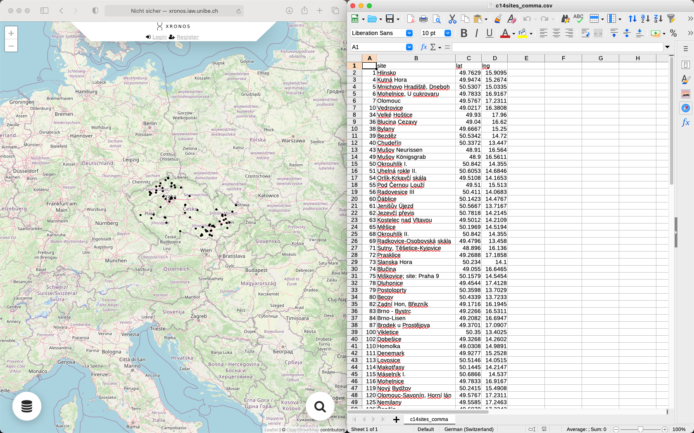
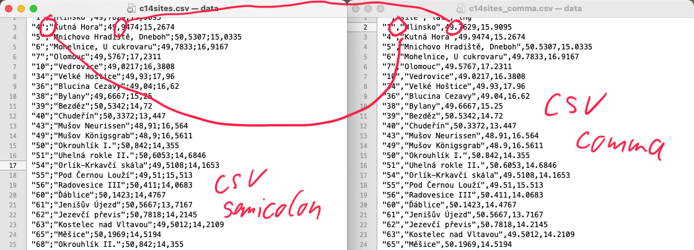

class: title-slide, center, middle
```{r, echo = FALSE}
# https://stackoverflow.com/questions/25646333/code-chunk-font-size-in-rmarkdown-with-knitr-and-latex
def.chunk.hook  <- knitr::knit_hooks$get("chunk")
knitr::knit_hooks$set(chunk = function(x, options) {
  x <- def.chunk.hook(x, options)
  ifelse(options$size != "normalsize", paste0("\\", options$size,"\n\n", x, "\n\n \\normalsize"), x)
})
```

```{r, echo = FALSE, results="asis"}
cat('# ', rmarkdown::metadata$title)
```

```{r, echo = FALSE, results="asis"}
cat('## ', rmarkdown::metadata$subtitle)
```

```{r, echo = FALSE, results="asis"}
cat('### ', rmarkdown::metadata$author)
```

```{r, echo = FALSE, results="asis"}
cat('#### ', rmarkdown::metadata$institute)
```

```{r, echo = FALSE, results="asis"}
cat(rmarkdown::metadata$date)
```

.footnote[
.right[
.tiny[
You can find the code and data of this presentation at [add_location](add_location).
]
]
]

---
class: inverse, bottom, right
# Introduction and Setting the Frame

---
## Definition

> *Point pattern analysis (PPA) is the study of the spatial arrangements of points in (usually 2-dimensional) space. - wikipedia*

### Centrography
- Measuring the parameters of some point distribution

### Density Analysis
- Visualisation ended up rotation of the density of points

### Distance based Analysis
- Statistical analyses of the distance between points and its distribution

### Modeling
- Modelling spatial processes and comparing the results to actual observed data

---

## Difficulties and tasks

### Get the data
You are responsible.

### Get the data into R
You will see how data needs to be structured to be able to read it into R.

### Using the right tools in the right way
I will demonstrate some tools and their application in special statistics.

### Making the right interpretations and conclusions
You are responsible (again).

---
class: inverse, bottom, right
# Data Preparation and Import

---

## Import formats

### Probably the standard (and worst possible) starting point

- Spreadsheet data 
  - here from our 14C database in development XRONOS
  - sites with 14C data of Czech Republic
  - not very complete... you probably know better sources (for the time being ;-) )


---

### Save as CSV

- CSV: Comma Separated Values
- you can im-/export csv from every spreadsheet software (MS Excel, Libre Office Calc, ...)


---
### CSV vs. 'CSV2'

- two flavours:
  - Anglo-American: comma ',' as column separator, point '.' as decimal separator
  - 'continental': semicolon as column separator, comma ',' as decimal separator
- which one you use depends on your language settings



---

## Reading csv into R

For reading CSV data into R, you can use the 'read.csv()' function.

Pay attention to use the correct function for your language settings.

```{r}
 # if you have an anglo-american csv (comma)
data <- read.csv("data/c14sites_comma.csv")
# if you have a continental csv (semicolon)
data <- read.csv2("data/c14sites.csv") 

data
```

---

## From data to spatial data

- There are multiple packages for handling spatial data
- Which one to use depends on preferences
- We are using sf here

```{r}
library(sf)

# Convert the dataframe to a spatial object. Note that the
# crs= 4326 parameter assigns a WGS84 coordinate system to the 
# spatial object
data.sf <- st_as_sf(data,
                    coords = c("lng", "lat"), # coordinate columns
                    crs = 4326)  # coordinate references system in epsg
data.sf
```

---

## Mapping the data

.pull-left[
### simple

Just use plot

```{r}
plot(data.sf)
```
]

.pull-right[
### more elaborated

using the gglot and natural earth data

.tiny[
```{r}
library(ggplot2)
library(rnaturalearth)

worldmap <- ne_countries(scale = 'medium', type = 'map_units',
                         returnclass = 'sf')
ggplot() + geom_sf(data = worldmap) + geom_sf(data=data.sf) +
    coord_sf(xlim = c(0,40), ylim = c(45,55)) + theme_bw()
```
]]


---

## Problem: lng-lat vs. projection

- Most of the tools for point pattern analyses required distances
- Unprojected coordinate reference systems like the longitude latitude system are not distance correct
- We have to re-project our data

.pull-left[
```{r}
plot(data.sf, graticule = TRUE)
```
]

.pull-right[
```{r}
data.utm <- st_transform(data.sf,
                         crs = 32633)
plot(data.utm, graticule = TRUE)
```
]

---

## To come from lng/lat spreadsheat to R spatial data:

### in three simple steps

```{r}
data <- read.csv2("data/c14sites.csv")
data.sf <- st_as_sf(data,
                    coords = c("lng", "lat"), # coordinate columns
                    crs = 4326)  # coordinate references system in epsg
data.utm <- st_transform(data.sf, crs = 32633)
```

---
class: inverse, bottom, right
# Centrography

---

## Center, standard distance and standard deviational ellipse
.pull-left[

.caption[source: https://mgimond.github.io]
]

.pull-left[
.tiny[
```{r}
mean_center <- apply(st_coordinates(data.utm),
                     2,
                     mean)

mean_center.df <- as.data.frame(t(mean_center))

mean_center.utm <- st_as_sf(mean_center.df,
                    coords = c("X", "Y"), 
                    crs = 32633)

standard_distance <- mean(
  st_distance(mean_center.utm,
              data.utm))

dx <- sqrt(
  sum(
    (st_coordinates(data.utm)[,1]-
         mean_center[1])^2
    ) / nrow(data.utm)
)

dy <- sqrt(
  sum(
    (st_coordinates(data.utm)[,2]-
       mean_center[2])^2
    ) / nrow(data.utm)
)
```
]
]

---

## Plot Center, standard distance and standard deviational ellipse
.pull-left[

.caption[source: https://mgimond.github.io]
]

.pull-left[
.tiny[
```{r}
library(aspace)


ellipse <- st_as_sf(calc_sde(points = st_coordinates(data.utm)),
                    coords = c(2,3), 
                    crs = 32633)

ggplot() + geom_sf(data = worldmap) + geom_sf(data=data.utm) +
  geom_sf(data=mean_center.utm, color="red") +
  geom_sf(data=st_buffer(mean_center.utm, standard_distance), fill="red", alpha = 0.5) +
  geom_sf(data=ellipse, fill="yellow", alpha = 0.5) +
    coord_sf(xlim = c(10,20), ylim = c(48,52)) + theme_bw() 
```
]
]
---
class: inverse, bottom, right
# Density based analysis

---
## Global density

The Density of a pattern in relationship to the overall area.

$$
\widehat{\lambda} = \frac{n}{a}
\label{eq:global-density}
$$

```{r}
cz.lnglat <- ne_countries(country = 'Czech Republic', returnclass = "sf", scale = "medium")
cz <- st_transform(cz.lnglat, crs = 32633)
cz.area <- st_area(cz)
nrow(data.utm)/cz.area
```

---
## Local density

The same, but measured at different locations, not only once for all. Which location depends on the approach.
### Quadrat density

Divide the area into squares and calculate the density by square.

```{r}
library(spatstat)
data.ppp <- as.ppp(data.utm)
marks(data.ppp)  <- NULL

Window(data.ppp) <- as.owin(cz)

plot(data.ppp)

#data.ppp <- rescale(data.ppp, 1000, "km")

data.quadcount <- quadratcount(data.ppp, nx= 8, ny=4)

plot(data.quadcount)

data.quaddens <- intensity(data.quadcount)

plot(intensity(data.quadcount, image = T))
```

---

### Kernel density

With a cold density estimation we avoid the problems of unequal base sizes resulting from the square. We also avoid arbitrary borders within our investigation area.

```{r}
data.kde <- density(data.ppp)
plot(data.kde)
contour(data.kde, add=T)
```

Different colour sizes can influence the result of the interpolation.

```{r}
data.kde2 <- density(data.ppp, sigma = 10000)
plot(data.kde2)
contour(data.kde2, add=T)
```

---
class: inverse, bottom, right
# Distance based analysis

---
## Density vs. Distance

- Investigating how points are distributed in respect to each other (second order property) vs. distributed in respect to the study extend
- reveals more of the mechanics of the process than its relationship to the general space and its features

.pull-left[
```{r, echo=F}
plot(data.kde2)
plot(data.ppp[1:3], add=T, col="green", pch=20)
```
]

.pull-right[
```{r, echo=F}
plot(data.ppp[1:3], pch=20)

data.coord <- st_coordinates(data.utm)
arrows(data.coord[c(1:3),1],data.coord[c(1:3,1),2], data.coord[c(2,3,1),1], data.coord[c(2,3,1),2], code=3, length = 0.1)
```
]

---
# Density (Point Pattern) Analysis
## Motivation

.pull-left[
* most basically tries to answer the question if data are clustered, regular spaced or random
* uninfluenced spatial processes tend to produce random patterns
* [Complete Spatial Randomness](https://en.wikipedia.org/wiki/Complete_spatial_randomness)
]

.pull-right[

]
.caption[https://gistbok.ucgis.org/]

---

## Archaeological Motivation

.pull-left[
* clustered patterns result from 'attractive' processes
  * if the presence of one object makes other objects more **likely**
  * eg. burial sites: usually, we have burial grounds/areas, so that burials tend to be clustered in the landscape
* regular patterns result from 'repulsive' processes
  * if the presence of one object makes other objects more **unlikely**
  * eg. settlement sites: usually, settlements need some area/hinterland, so that settlements tend to be more regular in the landscape
]

.pull-right[

]
.caption[https://gistbok.ucgis.org/]
---

## Distributions of Nearest Neighbor

The distribution of the nearest neighbor differ for different spatial distributions!

.pull-left[
```{r, echo=F}
library(spatstat)

win <- owin(c(0,10),c(0,10))
set.seed(12)

x <- rnorm(20, 5,1)
set.seed(14)

y <- rnorm(20,5,1)
P.cl <- ppp(x,y,window=win)

P.reg <- rSSI(2, 20, win = win)

P.rnd <- rpoint(20, win=win)

OP <- par(mfrow=c(1,3), mar=c(1,1,1,0))
 plot(P.reg, pch=20, cols=rgb(0,0,0,.5),
      main = "Regular Pattern")
 plot(P.cl, pch=20, cols=rgb(0,0,0,.5), main =
        "Clustered Pattern")
 plot(P.rnd, pch=20, cols=rgb(0,0,0,.5), main =
        "Random Pattern")
par(OP)
```
]

.pull-right[
```{r, echo=FALSE}
OP <- par(mfrow=c(1,3), mar=c(1,1,1,0))
hist(nndist(P.reg), xlim=c(0,4), ylim=c(0,20),
     main = "Regular Pattern")
hist(nndist(P.cl), xlim=c(0,4), ylim=c(0,20),
     main = "Clustered Pattern")
hist(nndist(P.rnd), xlim=c(0,4), ylim=c(0,20),
     main = "Random Pattern")
par(OP)
```
]

---
## The code for that example

.pull-left[
Simulate and plot

.tiny[
```{r, eval=F}
library(spatstat)

win <- owin(c(0,10),c(0,10))
set.seed(12)

x <- rnorm(20, 5,1)
set.seed(14)

y <- rnorm(20,5,1)
P.cl <- ppp(x,y,window=win)

P.reg <- rSSI(2, 20, win = win)

P.rnd <- rpoint(20, win=win)

OP <- par(mfrow=c(1,3), mar=c(1,1,1,0))
 plot(P.reg, pch=20, cols=rgb(0,0,0,.5),
      main = "Regular Pattern")
 plot(P.cl, pch=20, cols=rgb(0,0,0,.5), main =
        "Clustered Pattern")
 plot(P.rnd, pch=20, cols=rgb(0,0,0,.5), main =
        "Random Pattern")
par(OP)
```
]]

.pull-right[
Histogram

.tiny[
```{r, eval=FALSE}
OP <- par(mfrow=c(1,3), mar=c(1,1,1,0))
hist(nndist(P.reg), xlim=c(0,4), ylim=c(0,20),
     main = "Regular Pattern")
hist(nndist(P.cl), xlim=c(0,4), ylim=c(0,20),
     main = "Clustered Pattern")
hist(nndist(P.rnd), xlim=c(0,4), ylim=c(0,20),
     main = "Random Pattern")
par(OP)
```
]]

---

## Average Nearest Neighbor (ANN)

.pull-left[
**Average Nearest Neighbor (ANN)** measures the average distance of neighboring data points from a given observation. If it is compared with a theoretical random average distance, it tells much about whether data points are clustered or dispersed.

$$NearestNeighbor Dist ance = d(NN) = \frac{\sum^n_{i=1} min(d_{ij})}{N}$$
$$Theoretical Random Distance = d(ran) = 0.5*\sqrt\frac{A}{N}$$
$Nearest Neighbor Index = NNI = \frac{d(NN)}{d(ran)}$
]

.pull-right[

.caption[Average distance of nearest neighbors are shorter in the left. Source: https://towardsdatascience.com]
]

---

## Average Nearest Neighbor (ANN)

.pull-left[
$Nearest Neighbor Index = NNI = \frac{d(NN)}{d(ran)}$

* if the index is **below** 1, the points tend to be clustered
* if the index is **above** 1, the points tend to be regular
* if the index is **around** 1, the points tend to be random
]

.pull-right[

.caption[Average distance of nearest neighbors are shorter in the left. Source: https://towardsdatascience.com]
]

---
## Average Nearest Neighbor (ANN) in R

A simple measurement for the average value of the nearest neighbour of a point pattern 

.pull-left[
```{r, echo=F}
OP <- par(mfrow=c(1,3), mar=c(1,1,1,0))
 plot(P.reg, pch=20, cols=rgb(0,0,0,.5), main = "Regular Pattern")
 plot(P.cl, pch=20, cols=rgb(0,0,0,.5), main = "Clustered Pattern")
 plot(P.rnd, pch=20, cols=rgb(0,0,0,.5), main = "Random Pattern")
par(OP)
```
]

.pull-right[
```{r}
mean(nndist(P.reg))
mean(nndist(P.cl))
mean(nndist(P.rnd))

ann.ran <- 0.5 * sqrt(10*10 / 20)
ann.ran
```
]

---
## Average Nearest Neighbor (ANN) for CZ

.pull-left[
```{r}
data.ann <- mean(nndist(data.ppp))
data.ann

a_data <- area(as.owin(cz))
n_data <- nrow(data.utm)
ann.ran <- 0.5 * sqrt(a_data/n_data)

data.ann/ann.ran
```
]

.pull-right[

.caption[Average distance of nearest neighbors are shorter in the left. Source: https://towardsdatascience.com]
]
---

## Nearest Neighbor Analysis - Restrictions

.pull-left[
- what we consider regular is strongly scale dependend
- also, some processes might be regular in one scale, while clustered in another
- eg. burials around settlements:
  - Settlements might be regular spaced
  - Burials might be clustered around settlements
  - if we have only the burials, in the landscape the might have a similar structure like the example
]

.pull-right[

]

---

## Neighbor Analysis over multiple scales
### The K function

.pull-left[
The **K-Function** (or **Ripley`s K**) measures distances between all points in space rather than just the neighbors as in ANN. It also helps to understand how clustering or dispersion of data occurs in different distances from its center (the centroid).


.caption[Statistical significance of Ripley’s K function. Source: https://gistbok.ucgis.org]
]
.pull-right[

.caption[K-Function describing how clustering occurs in different scanning horizon from the center. Source: https://towardsdatascience.com]
]

---

### K Function in R

```{r}
K <- Kest(data.ppp)
plot(K, main=NULL, las=1, legendargs=list(cex=0.8, xpd=TRUE, inset=c(1.01, 0) ))
```

---

### K Funktion with Envelope

```{r}
plot(envelope(data.ppp, Kest))
```

---

## inhomogenous point processes

---
## inhomogenous point processes in R

```{r}
K_in <- Kinhom(data.ppp)

plot(K_in, main = "K function for inhomogenuous point processes")
```

---
## inhomogenous point processes in R with envelope

.pull-left[
```{r}
lambda <- density.ppp(data.ppp)
plot(lambda)
plot(data.ppp, add=T)
```
]

.pull-right[
```{r}
Ken <- envelope(data.ppp, 'Kinhom',
                  simulate=expression(rpoispp(lambda)),
                  correction="trans")
plot(Ken)
```
]
---
class: inverse, bottom, right
# Covariates
---
## Covariates

---
### Elevation as Covariate
.pull-left[
```{r}
library(raster)
library(maptools)
elev <- raster::getData(name="alt", country = "CZ")

elev.utm <- projectRaster(elev, crs=32633)

elev.im <- as.im.RasterLayer(elev.utm)

plot(elev.im)
```
]

.pull-right[
```{r}

rho <- rhohat(data.ppp, elev.im,  method="ratio")

plot(rho)
```
]

---

### Compare prediction with ground truth

.pull-left[
```{r}
pred <- predict(rho)
cl   <- interp.colours(c("lightyellow", "orange" ,"red"), 100) # Create color scheme
plot(pred, col=cl, las=1, main=NULL, gamma = 0.25)
plot(data.kde, col=cl, las=1, main=NULL, gamma = 0.25)
```
]

.pull-right[
```{r}
plot(data.kde, col=cl, las=1, main=NULL, gamma = 0.25)
```
]

---
### Modelling the relationship

```{r}
# Create the Poisson point process model
PPM1 <- ppm(data.ppp ~ elev.im)
# Plot the relationship
plot(effectfun(PPM1, "elev.im", se.fit=TRUE), main=NULL,
     las=1, legendargs=list(cex=0.8, xpd=TRUE, inset=c(1.01, 0) ))
```

---
class: inverse, bottom, right
# Monte Carlo Simulation and Hypothesis tests

---

## Exploring the random range

Remember:

```{r}
ann.p <- mean(nndist(data.ppp, k=1))
ann.p
```

```{r}
n     <- 100               # Number of simulations
ann.r <- vector(length = n) # Create an empty object to be used to store simulated ANN values
for (i in 1:n){
  rand.p   <- rpoint(n=data.ppp$n, win=cz)  # Generate random point locations
  ann.r[i] <- mean(nndist(rand.p, k=1))  # Tally the ANN values
}
```

---
### homogeneous
.pull-left[
```{r}
plot(rand.p, pch=16, main=NULL, cols=rgb(0,0,0,0.5))
```
]

.pull-right[
```{r}
hist(ann.r, main=NULL, las=1, breaks=40, col="bisque", xlim=range(ann.p, ann.r))
abline(v=ann.p, col="blue")
```
]
---

### based on elevation

.pull-left[
```{r}
plot(elev.im)
```

]
.pull-right[
Invert the Elevation
```{r}
elev.rescale <- 1- (elev.im- min(elev.im)) /(max(elev.im)-min(elev.im))

plot(elev.rescale)
```
]

---
### Modeling based on Elevation

```{r}
n     <- 100
ann.r <- vector(length=n)
for (i in 1:n){
  rand.p   <- rpoint(n=data.ppp$n, f=elev.rescale)
  ann.r[i] <- mean(nndist(rand.p, k=1))
}
```

.pull-left[
```{r}
Window(rand.p) <- as.owin(cz)  # Replace raster mask with ma.km window
plot(rand.p, pch=16, main=NULL, cols=rgb(0,0,0,0.5))
```
]

.pull-right[
```{r}
hist(ann.r, main=NULL, las=1, breaks=40, col="bisque", xlim=range(ann.p, ann.r))
abline(v=ann.p, col="blue")
```
]

---
### hypothese test
.pull-left[
```{r}
PPM1
```
]

.pull-right[
```{r}
PPM0 <- ppm(data.ppp ~ 1)
PPM0
```
]

```{r}
anova(PPM0, PPM1, test="LRT")
```

